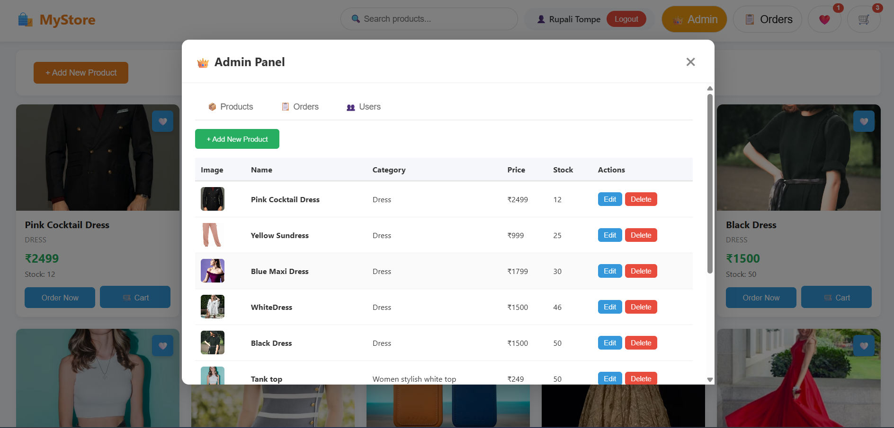
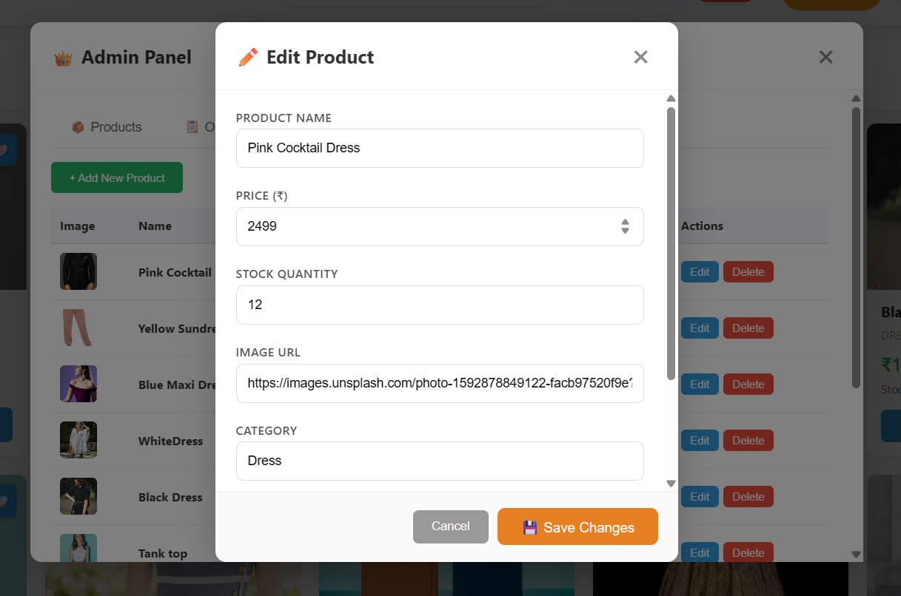
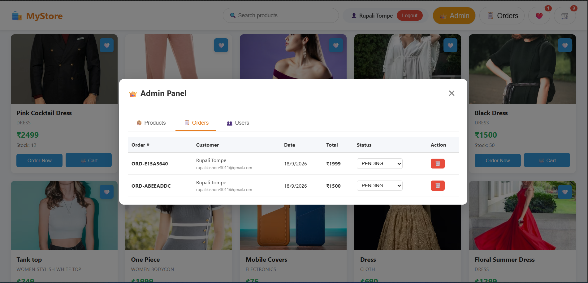
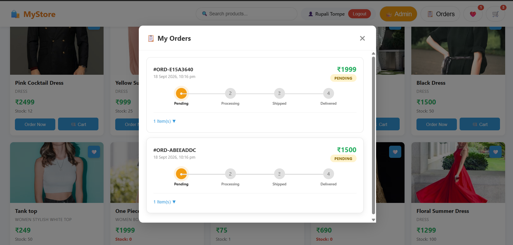
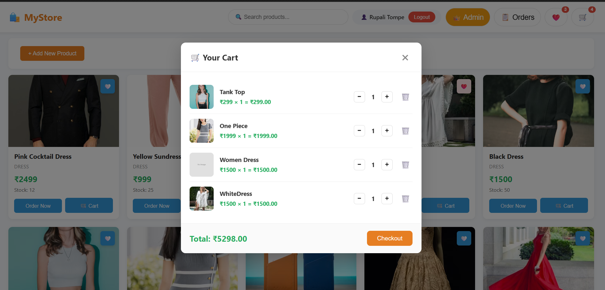

# 🛍️ MyStore — Full-Stack E-Commerce Application

A modern e-commerce platform built with Spring Boot 4.1.1, GraphQL, and vanilla JavaScript.

## ✨ Features

### Customer Features
- 🔍 Browse & search products
- 🛒 Shopping cart with quantity management
- ❤️ Favorites/Wishlist
- 📦 Order placement & tracking
- 👤 User registration & login
- 🔐 Forgot/Reset password

### Admin Features
- 👑 Admin dashboard
- 📦 Product CRUD operations
- 📋 Order management with status updates
- 👥 User management

## 🛠️ Tech Stack

**Backend:** Spring Boot 4.1.1, GraphQL, JWT, Hibernate 7.x  
**Database:** MariaDB 10.4  
**Frontend:** HTML5, CSS3, Vanilla JavaScript  
**Docs:** Swagger/OpenAPI 3.0

## 📸 Screenshots

### 🏠 Homepage — Product Listing


### 👑 Admin Panel — Products Management


### ✏️ Edit Product Modal


### 👥 Admin Panel — Users Management


### 📋 Admin Panel — Orders Management


### 📦 My Orders — Order Tracking


### 🛒 Shopping Cart


## 🚀 Setup

### Prerequisites
- Java 17+ (Java 25 recommended)
- Maven
- MariaDB / MySQL
- Node.js (for frontend)

### Installation

1. **Clone repo:**
```bash
git clone https://github.com/RupaliKishore/mystore-ecommerce.git
cd mystore-ecommerce
