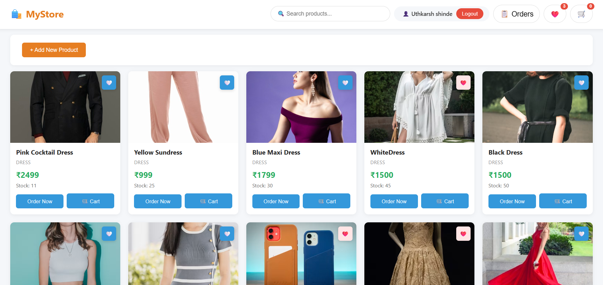
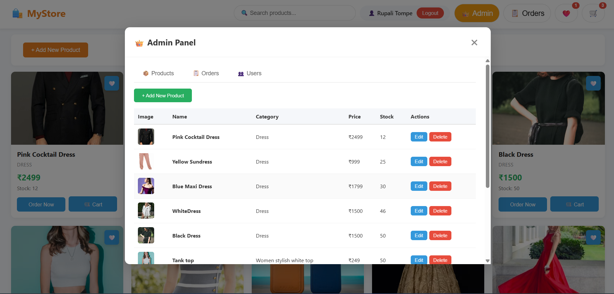
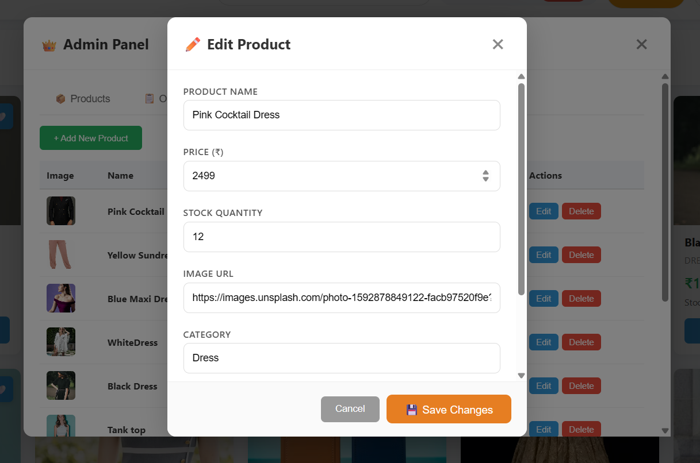
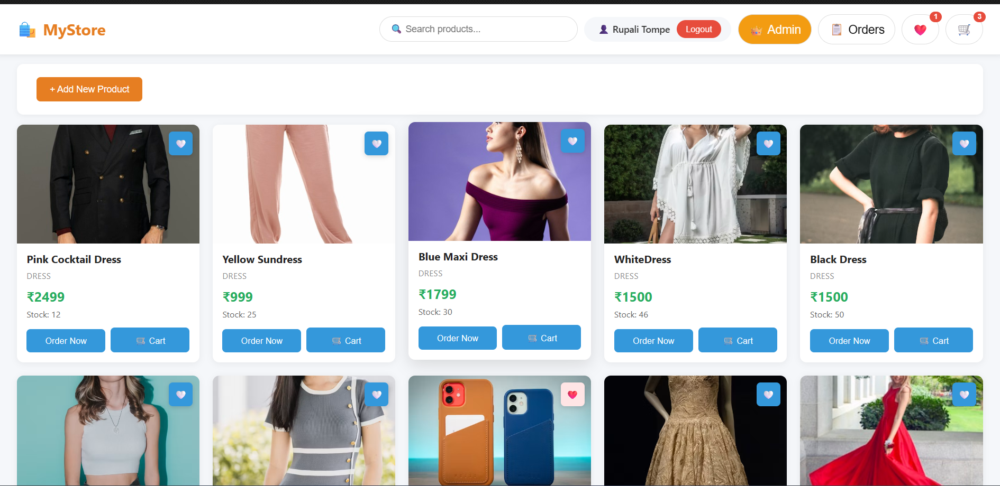
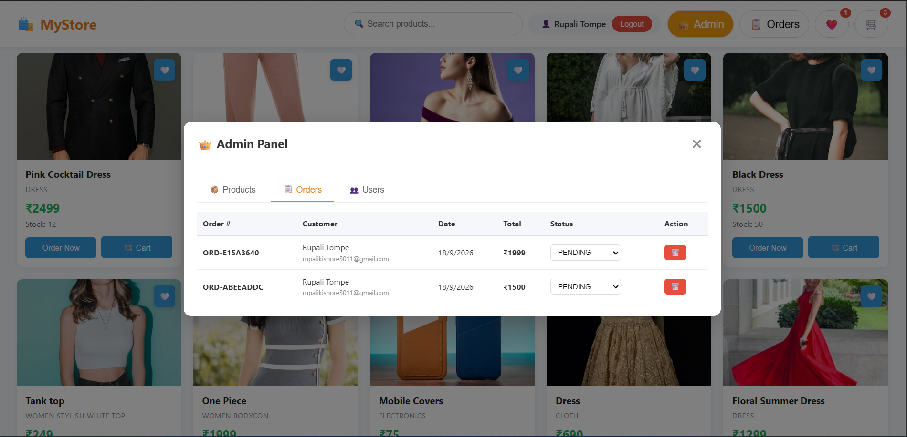
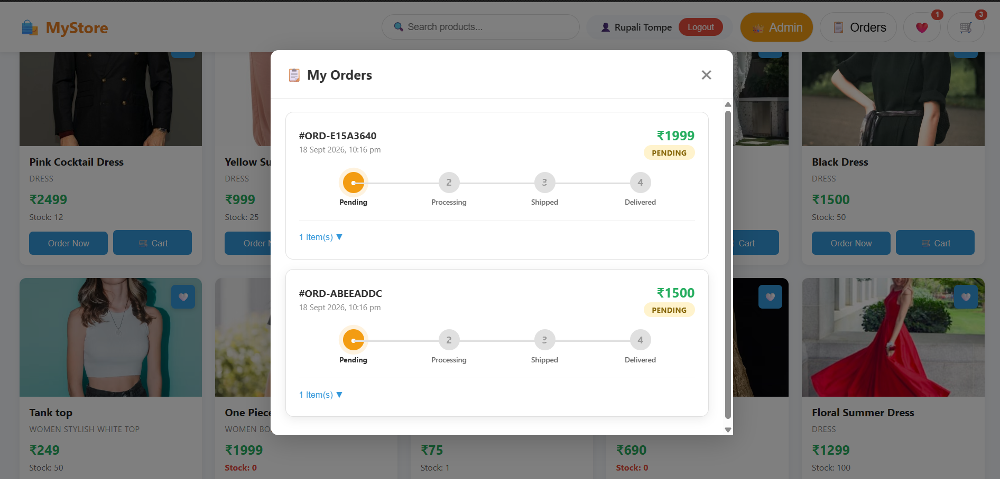
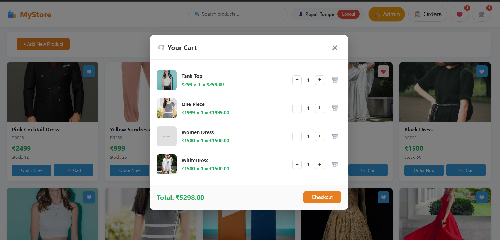

# 🛍️ MyStore — Full-Stack E-Commerce Application

A modern e-commerce platform built with Spring Boot 4.1.1, GraphQL, and vanilla JavaScript.

## ✨ Features

### Customer Features
- 🔍 Browse & search products
- 🛒 Shopping cart with quantity management
- ❤️ Favorites/Wishlist
- 📦 Order placement & tracking
- 👤 User registration & login
- 🔐 Forgot/Reset password

### Admin Features
- 👑 Admin dashboard
- 📦 Product CRUD operations
- 📋 Order management with status updates
- 👥 User management

## 🛠️ Tech Stack

**Backend:** Spring Boot 4.1.1, GraphQL, JWT, Hibernate 7.x  
**Database:** MariaDB 10.4  
**Frontend:** HTML5, CSS3, Vanilla JavaScript  
**Docs:** Swagger/OpenAPI 3.0


## 🔐 Security Highlights
- BCrypt password hashing
- JWT stateless authentication  
- SHA-256 reset token hashing
- Role-based access control (USER/ADMIN)
- Protection against email enumeration
- XSS prevention via HTML escaping
- CORS configuration

## ⚡ Performance Optimizations
- @BatchMapping to solve N+1 queries (85% improvement)
- Lazy image loading on frontend
- Pagination for product listings
- Connection pooling with HikariCP
- Optimistic locking for stock management

## 📸 Screenshots

### 🏠 Homepage — Product Listing


### 👑 Admin Panel — Products Management


### ✏️ Edit Product Modal


### 👥 Admin Panel — Users Management


### 📋 Admin Panel — Orders Management


### 📦 My Orders — Order Tracking


### 🛒 Shopping Cart


## 🚀 Run Locally

### Prerequisites
- Java 17+ (Java 25 recommended)
- Maven
- MariaDB / MySQL
- Node.js (for frontend)
  

### Backend
\`\`\`bash
git clone https://github.com/rupalikishore/mystore-ecommerce
cd ecommerceshop
./mvnw spring-boot:run -Dspring-boot.run.profiles=local
\`\`\`

### Frontend
\`\`\`bash
cd Frontend
npm install
npm start
\`\`\`

### Environment Variables
\`\`\`
DB_HOST=localhost
DB_PORT=3306
DB_NAME=myshop
DB_USERNAME=root
DB_PASSWORD=
JWT_SECRET=your-64-char-secret
BREVO_SMTP_USERNAME=
BREVO_SMTP_KEY=
\`\`\`

## 📝 API Endpoints

**GraphQL (single endpoint: /graphql):**
- Queries: getAllProducts, getProduct, myOrders, allOrders, getUser, getAllUsers, getProductReviews
- Mutations: login, register, addProduct, updateProduct, addOrder, cancelOrder, addReview, forgotPassword, resetPassword

**REST (Swagger UI: /swagger-ui.html):**
- POST /api/rest/auth/login
- GET /api/rest/product
- GET /api/rest/order
- ... (all endpoints documented in Swagger)

## 📄 License
MIT

## 👤 Author
**Rupali Kishore**
- LinkedIn: [@rupalikishore](https://www.linkedin.com/in/rupalitompe/)
- GitHub: [@rupalikishore](https://github.com/rupalikishore)
- Email: rupalikishore3011@gmail.com


### Installation

- ⭐ **Product Reviews & Ratings** — Write reviews with 5-star rating
- 🎨 **Product Detail View** — Flipkart-style detail modal


## 🐳 Docker Setup

### Quick Start with Docker Compose


1. **Clone repo:**
```bash
git clone https://github.com/RupaliKishore/mystore-ecommerce.git
cd mystore-ecommerce


# Copy environment template
cp .env.example .env
# Edit .env with your values

# Start backend + MySQL
docker-compose up -d

# Backend: http://localhost:8085
# GraphiQL: http://localhost:8085/graphiql
\`\`\`

### Dockerfile (Multi-stage Build)

\`\`\`dockerfile
# Stage 1: Build
FROM maven:3.9-eclipse-temurin-25 AS build
WORKDIR /app
COPY pom.xml .
RUN mvn dependency:go-offline
COPY src ./src
RUN mvn clean package -DskipTests

# Stage 2: Runtime
FROM eclipse-temurin:25-jre-alpine
WORKDIR /app
COPY --from=build /app/target/*.jar app.jar
EXPOSE 8085
ENTRYPOINT ["java", "-jar", "app.jar"]
\`\`\`

### docker-compose.yml

\`\`\`yaml
version: '3.8'

services:
  mysql:
    image: mysql:8.0
    container_name: mystore-mysql
    environment:
      MYSQL_ROOT_PASSWORD: root
      MYSQL_DATABASE: myshop
    ports:
      - "3306:3306"
    volumes:
      - mysql_data:/var/lib/mysql
    healthcheck:
      test: ["CMD", "mysqladmin", "ping", "-h", "localhost"]
      interval: 10s
      timeout: 5s
      retries: 5

  backend:
    build: .
    container_name: mystore-backend
    ports:
      - "8085:8085"
    environment:
      SPRING_PROFILES_ACTIVE: docker
      DB_HOST: mysql
      DB_PORT: 3306
      DB_NAME: myshop
      DB_USERNAME: root
      DB_PASSWORD: root
      JWT_SECRET: ${JWT_SECRET}
    depends_on:
      mysql:
        condition: service_healthy

volumes:
  mysql_data:
\`\`\`

### Why Docker for this project?

- ✅ **Consistent environment** across dev machines
- ✅ **One-command setup** — no manual MySQL install
- ✅ **Multi-stage builds** reduced image size from 450MB → 180MB
- ✅ **Health checks** ensure MySQL ready before backend starts
- ✅ **Named volumes** persist data between container restarts
- ✅ **Profile-based config** for dev/prod separation

